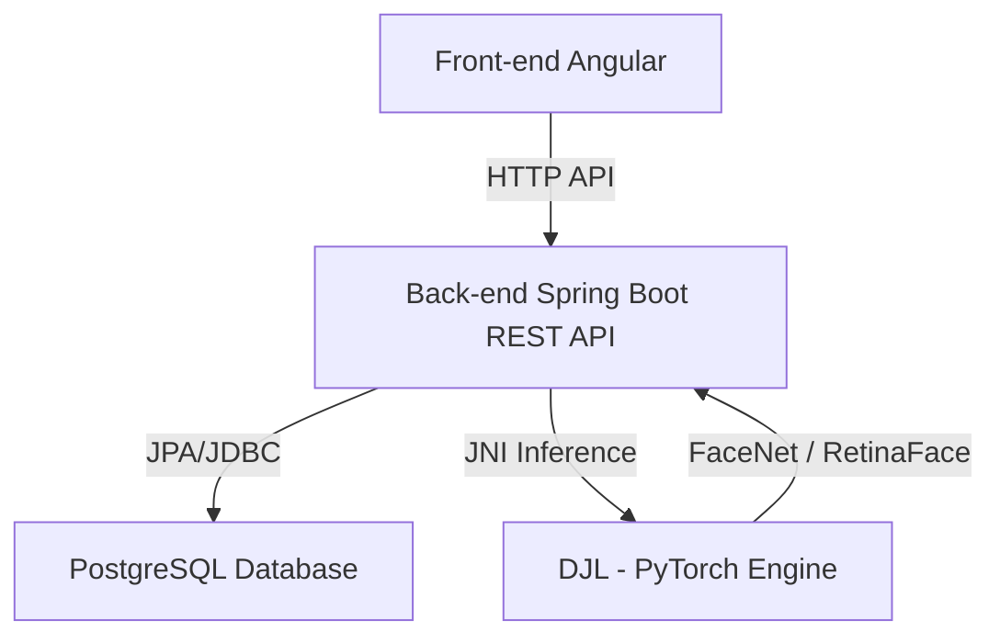

# 👤 Face Registry - Sistema de Cadastro e Reconhecimento Facial

Este repositório contém a implementação do desafio para a vaga de **Desenvolvedor Full Stack Java e Angular**. O objetivo do sistema é gerenciar o cadastro de usuários e suas fotos, além de realizar a **Verificação Facial (1:1)** e a **Identificação Facial (1:n)** de forma eficiente, estável e concorrente.

---

## 🏗️ Arquitetura do Sistema

O ecossistema é composto por três camadas principais:

1. **Front-end (Angular):** Interface rica, moderna e responsiva para gerenciar usuários, cadastros individuais/lotes e realizar as comparações biométricas em tempo real.
2. **Back-end (Spring Boot REST API):** Engine transacional em Java responsável pela lógica de negócios, controle de concorrência, persistência e integração com os modelos de Visão Computacional.
3. **Banco de Dados (PostgreSQL):** Persistência relacional robusta que armazena os dados dos usuários (Nome, CPF, Foto) e os **Templates Faciais (Embeddings)** pré-calculados para alta performance nas buscas biológicas.



---

## 🛠️ Stack Tecnológica

- **Back-end:** Java 21+ (compilado e executado com OpenJDK 26), Spring Boot 3.2.4, Spring Data JPA, Maven.
- **Biometria & IA:** **DJL (Deep Java Library)** integrando o motor do PyTorch para detecção com RetinaFace e extração com FaceNet/ArcFace.
- **Banco de Dados:** PostgreSQL 15+.
- **Front-end:** Angular 17+ (com HttpClient e RxJS para chamadas assíncronas).
- **Ambiente/DevOps:** Docker e Docker Compose.

---

## 🧠 Design Biométrico (Reconhecimento Facial)

Para atender aos requisitos de **Verificação (1:1)** e **Identificação (1:n)** com alta performance, adotaremos a técnica de extração de características (embeddings):

1. **Detecção e Isolamento:** Ao enviar uma imagem, o backend utiliza um modelo de detecção de rostos (como **RetinaFace**) para validar se há exatamente 1 rosto na imagem. Imagens sem rostos ou com múltiplos rostos são rejeitadas com erro HTTP 400.
2. **Extração de Embedding:** O rosto detectado é normalizado, redimensionado e processado pelo modelo **FaceNet/ArcFace** para gerar um vetor numérico tridimensional de **512 floats (embedding)**.
3. **Persistência de Embeddings:** No cadastro, o embedding é calculado e salvo diretamente no banco de dados em uma coluna do tipo `REAL[]`.
4. **Similaridade por Cosseno:** A comparação de similaridade entre duas fotos é feita calculando a similaridade de cosseno entre seus respectivos vetores.
5. **Threshold Configurável:** O limite mínimo (threshold) para aceitar uma correspondência é configurado via arquivo de propriedade (`application.yml` ou variáveis de ambiente), permitindo ajustes sem alteração de código.

---

## ⚡ Concorrência e Processamento em Lote

O desafio exige tratamento correto de concorrência para cadastro em massa de usuários. Para isso:
- O endpoint `POST /api/users/batch` receberá uma lista de registros.
- Cada inserção e processamento de imagem será delegado a threads separadas utilizando recursos modernos do Java (como `CompletableFuture` ou `StructuredTaskScope` com Virtual Threads).
- Serão implementados mecanismos de lock (otimista ou pessimista no JPA) para proteção de dados e evitar condições de corrida durante atualizações simultâneas de biometria para um mesmo usuário.
- Garantia de transações atômicas: os dados são consolidados no banco de dados garantindo a consistência completa.

---

## 🗺️ Roteiro de Implementação (Roadmap)

Toda a execução do desafio está organizada em fases bem estruturadas. Para verificar o plano detalhado e acompanhar o status de cada etapa, acesse o nosso roteiro passo a passo:

👉 **[Acesse o Roteiro Passo a Passo (step_by_step.md)](file:///o:/JavaProjects/face-registry/step_by_step.md)**

---

## 🚀 Como Executar o Projeto (Planejado)

### Requisitos Prévios
- Docker e Docker Compose instalados.
- OpenJDK 21+ instalado localmente (caso queira rodar o back-end fora do container).

### Inicialização Rápida com Docker
```bash
# Para subir todo o ecossistema (Postgres, Backend e Frontend)
docker compose up --build
```
Após o build e inicialização dos containers:
- O painel do frontend estará disponível em: `http://localhost:4200`
- A documentação interativa da API (Swagger UI) estará disponível em: `http://localhost:8080/swagger-ui.html`