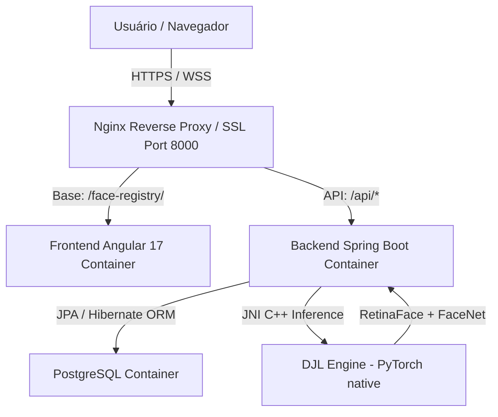

# 👤 Face Registry - Sistema de Cadastro e Reconhecimento Facial

Este repositório contém a implementação completa do sistema **Face Registry**, um desafio para a vaga de **Desenvolvedor Full Stack Java e Angular**. O sistema gerencia o cadastro de usuários e suas fotos, realizando a **Verificação Facial (1:1)**, a **Identificação Facial (1:N)** de forma concorrente e a **Prevenção de Cadastros Duplicados** com alta performance e precisão biométrica.

O projeto está totalmente funcional em ambiente de produção sob o domínio público [https://jarvis.xyz.br/face-registry/](https://jarvis.xyz.br/face-registry/).

---

## 🗂️ Documentação Detalhada do Projeto

Para facilitar o entendimento, a manutenção e a implantação, a documentação técnica foi estruturada em guias especializados:

*   **[🏗️ Arquitetura e Engenharia de Software (docs/architecture.md)](file:///o:/JavaProjects/face-registry/docs/architecture.md):** Detalha o fluxo biométrico, concorrência otimizada com **Virtual Threads (Java 21)**, cache em memória protegido por **Locks** e integração de IA com a biblioteca **Deep Java Library (DJL)** e motor **PyTorch** nativo.
*   **[📞 Manual da REST API (docs/api.md)](file:///o:/JavaProjects/face-registry/docs/api.md):** Catálogo de todos os endpoints expostos pelo Spring Boot (CRUD, lotes, verificação 1:1, identificação 1:N), DTOs de request/response e tratamento de erros padronizado.
*   **[💾 Persistência e Estrutura de Dados (docs/database.md)](file:///o:/JavaProjects/face-registry/docs/database.md):** Detalhamento do esquema do banco de dados PostgreSQL, índices de CPF, serialização de embeddings de 512 dimensões como `VARCHAR` e otimização de consultas de cache por DTO de projeção leve.
*   **[🎨 Interface e Front-end (docs/frontend.md)](file:///o:/JavaProjects/face-registry/docs/frontend.md):** Explica a arquitetura standalone do **Angular 17**, captura de câmera webcam nativa da API HTML5 e o mecanismo interativo de zoom, movimentação (Pan) e recorte de rostos no Canvas.
*   **[🚀 Implantação e DevOps (docs/deployment.md)](file:///o:/JavaProjects/face-registry/docs/deployment.md):** Manual completo de orquestração de containers com **Docker Compose**, geração automática de certificados SSL/HTTPS no Nginx para webcam e túnel seguro do Cloudflare.

---

## 🏗️ Resumo da Arquitetura do Sistema

O ecossistema é projetado de forma modular e conteinerizada, garantindo independência de serviços e facilidade de deploy:

1.  **Front-end (Angular 17+):**
    *   Roda em um servidor **Nginx** configurado com **SSL/HTTPS** (necessário para habilitar webcam).
    *   Interface responsiva com estética glassmorphic, micro-animações, loaders e feedbacks em tempo real.
    *   Suporte a captura via webcam nativa da API de mídia do navegador ou upload de arquivos locais.
2.  **Back-end (Spring Boot 3 + Java 21):**
    *   Engine transacional REST API responsável pela lógica de negócios, controle de concorrência, transações ACID e orquestração de IA.
    *   Processamento assíncrono utilizando **Virtual Threads (Java 21)** e pool de threads otimizados para operações em lote.
    *   Executa inferência nativa de Deep Learning via interface JNI.
3.  **Banco de Dados (PostgreSQL 15):**
    *   Armazena dados cadastrais, a foto original em formato binário (`BYTEA`) e os **Templates Faciais (Embeddings)** pré-calculados de 512 dimensões serializados como `VARCHAR`.



---

## 🔒 Regras de Negócio e Segurança Biométrica

*   **Similaridade por Cosseno / Produto Escalar:** A similaridade entre faces é baseada em produto escalar de vetores L2-normalizados, operando com threshold padrão de **0.60** (customizável via `application.yml`).
*   **Prevenção de Duplicados:** O cadastro individual de usuários, bem como atualizações de fotos, rastreiam a base de dados em memória. Se a foto enviada corresponder a um rosto já cadastrado por outra pessoa, a operação é bloqueada retornando `409 Conflict` contendo o nome e o CPF do usuário já registrado.
*   **Transações de Lote Atômicas:** No upload em lote (`POST /api/users/batch`), a transação garante que o lote inteiro seja revertido (rollback) caso haja alguma duplicidade facial interna no lote, no banco, ou erro de processamento de imagem em qualquer registro.

---

## 📂 Diretório de Imagens para Testes 1:1

Para facilitar a verificação e homologação da biometria 1:1 na aba **"Verificar Biometria"** da interface, a pasta [examples/to-compare](file:///o:/JavaProjects/face-registry/examples/to-compare/) foi populada com fotos alternativas (retratos e poses diferentes) das celebridades cadastradas no banco de dados.

Os arquivos seguem o padrão `pessoa_cpf_N.ext`, facilitando a identificação e a cópia do CPF na interface:
- **Barack Obama (CPF 64657075942)**: `obama_64657075942_2.jpg`, `obama_64657075942_3.jpg`, `obama_64657075942_alt.jpg`
- **Joe Biden (CPF 21603180001)**: `biden_21603180001_2.jpg`, `biden_21603180001_3.jpg`, `biden_21603180001_alt.jpg`
- **Elon Musk (CPF 92230775596)**: `musk_92230775596_2.jpg`, `musk_92230775596_3.jpg`, `musk_92230775596_alt.jpg`
- **Lionel Messi (CPF 74394356644)**: `messi_74394356644_2.jpg`, `messi_74394356644_3.jpg`, `messi_74394356644_alt.jpg`
- **Kana (CPF 62079744844)**: `kana_62079744844_2.jpg`, `kana_62079744844_3.jpg`, `kana_62079744844_alt.jpg`
- **Lena (CPF 83992409821)**: `lena_83992409821_1.jpg`, `lena_83992409821_2.png`, `lena_83992409821_alt.png`

---

## 🚀 Como Executar o Projeto Localmente

### Pré-requisito
Certifique-se de possuir o **Docker** e o **Docker Compose** instalados no seu host.

### Inicialização Rápida
1.  Na pasta raiz do projeto, execute o comando abaixo para construir as imagens e iniciar os serviços:
    ```bash
    docker compose up --build -d
    ```
2.  Monitore os logs de inicialização (em especial o download e carregamento dos modelos pelo DJL):
    ```bash
    docker compose logs -f backend
    ```

---

## ☁️ Implantação e Deploy em Produção (AWS EC2)

A implantação em produção é realizada em uma instância **Amazon EC2 (Ubuntu Server 22.04 LTS)** orquestrada com Docker. 

Devido ao processamento pesado e consumo de memória do motor PyTorch (DJL) na extração dos embeddings faciais, recomenda-se o uso de instâncias com pelo menos **4 GB de RAM (t3.medium ou superior)** para evitar travamento de CPU e estouros de memória.

Para o roteiro passo a passo detalhado de criação da instância EC2 na AWS, instalação do motor Docker e inicialização da stack com Docker Compose, consulte o guia de deploy:
👉 **[Guia de Implantação e DevOps (docs/deployment.md)](file:///o:/JavaProjects/face-registry/docs/deployment.md#-implanta%C3%A7%C3%A3o-na-nuvem-aws-ec2)**

---

## 🌐 Endereços e Acesso aos Serviços

Após o start completo da stack:
- **Painel Front-end (Nginx/HTTPS):** Disponível em [https://localhost:8000/face-registry/](https://localhost:8000/face-registry/)
- **Documentação REST API (Swagger UI):** Disponível em [http://localhost:8080/swagger-ui.html](http://localhost:8080/swagger-ui.html)
- **API REST Backend:** Rodando na porta `8080` (ex: [http://localhost:8080/api/users](http://localhost:8080/api/users)).