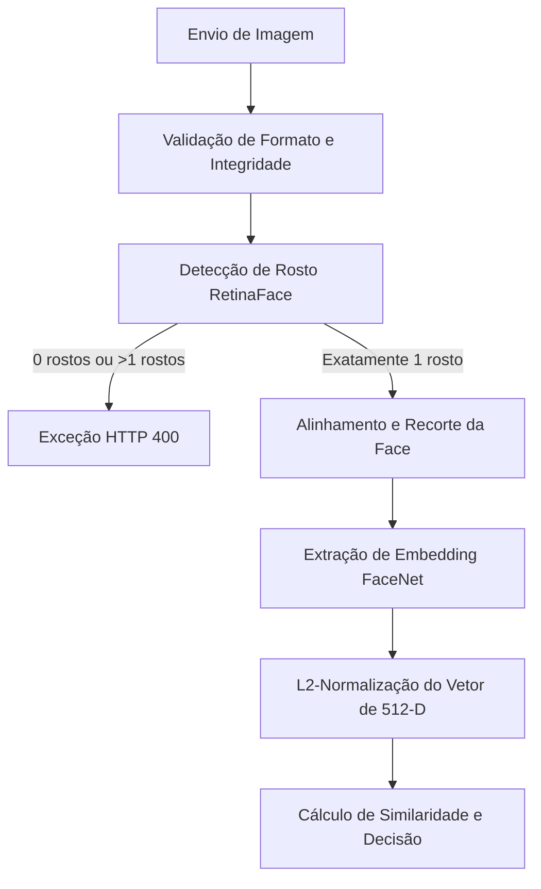
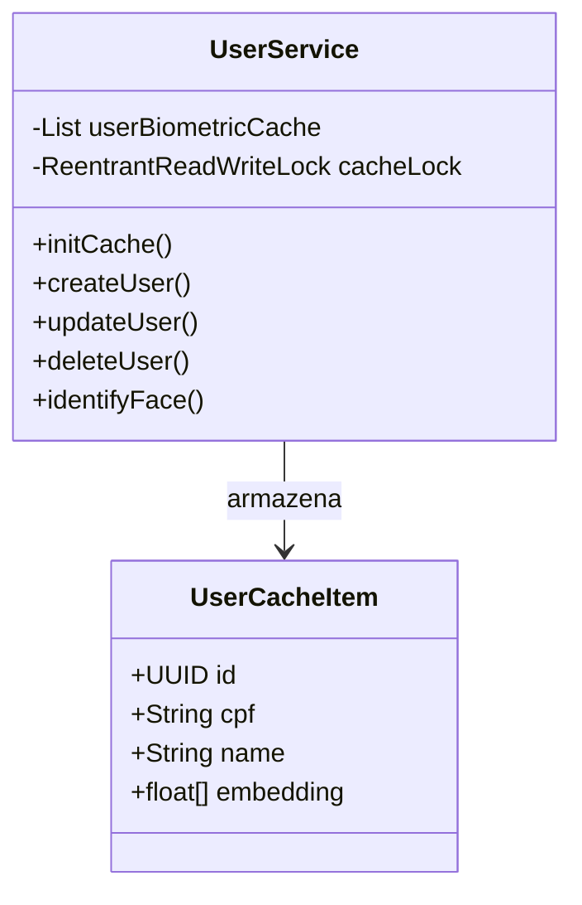

# 🏗️ Arquitetura do Sistema - Face Registry

Este documento detalha os aspectos de arquitetura, engenharia de software e escolhas de design aplicadas no ecossistema **Face Registry**. O sistema é composto por um front-end standalone em Angular 17+, um back-end transacional em Spring Boot 3 (Java 21) e banco de dados PostgreSQL.

---

## Visão Geral do Fluxo Biométrico

O processamento e comparação biométrica de rostos segue uma sequência rigorosa em quatro etapas:



1. **Validação:** A imagem enviada via requisição multipart é validada quanto à sua integridade (decodificação de buffer via `ImageIO`) e formatos aceitos.
2. **Detecção:** O modelo **RetinaFace** localiza o rosto na imagem. O sistema exige a presença de **exatamente um rosto**.
3. **Extração:** A região recortada do rosto é redimensionada e processada pelo modelo **FaceNet** para gerar um vetor numérico de **512 dimensões** (embeddings).
4. **Decisão:** O embedding é L2-normalizado e comparado a outros embeddings cadastrados usando produto escalar (similaridade de cosseno) contra o limiar de decisão (*threshold*).

---

## 🧠 Integração de IA com Deep Java Library (DJL)

Para evitar a sobrecarga de rede, latência e complexidade gerada ao manter uma API paralela em Python (por exemplo, usando Flask ou FastAPI), o sistema realiza a inferência de IA diretamente na JVM através do **Deep Java Library (DJL)** criado pela AWS.

- **Vínculo Nativo (JNI):** O DJL carrega as bibliotecas dinâmicas do **PyTorch** nativo de forma automática para o sistema operacional hospedado. No Linux/Docker, ele mapeia chamadas JNI de forma de alta performance, comunicando-se com a GPU ou CPU física.
- **Detecção Facial (RetinaFace):**
  - Implementado em [FaceDetectionTranslator](file:///o:/JavaProjects/face-registry/backend/src/main/java/com/batistell/faceregistry/service/FaceDetectionTranslator.java).
  - Executa a localização espacial, caixas delimitadoras e probabilidade de confiança de rostos.
- **Extração de Assinatura Facial (FaceNet):**
  - Implementado em [FaceFeatureTranslator](file:///o:/JavaProjects/face-registry/backend/src/main/java/com/batistell/faceregistry/service/FaceFeatureTranslator.java).
  - Normaliza os canais RGB e gera os 512 valores em float que sumarizam a geometria facial da pessoa.

---

## ⚡ Concorrência e Performance

O sistema foi desenhado para atuar com alta concorrência em produção:

### 1. Threads Virtuais (Java 21 Virtual Threads)
O endpoint de upload e processamento em lote (`POST /api/users/batch`) distribui a tarefa pesada de ler imagens e fazer inferência de IA usando um pool de threads virtuais:
```java
private final Executor virtualThreadExecutor = Executors.newVirtualThreadPerTaskExecutor();
```
Isso permite criar milhares de threads leves sem impacto na memória física do sistema operacional, maximizando a taxa de transferência durante grandes cargas.

### 2. Cache Biométrico em Memória
Para evitar a consulta de dados binários do banco (`BYTEA` no PostgreSQL) e parsing repetitivo de strings nas buscas de similaridade $O(N)$, a classe [UserService](file:///o:/JavaProjects/face-registry/backend/src/main/java/com/batistell/faceregistry/service/UserService.java) implementa um cache em memória (`userBiometricCache`) alimentado na inicialização via consulta otimizada de projeção ([UserLightweight](file:///o:/JavaProjects/face-registry/backend/src/main/java/com/batistell/faceregistry/dto/UserLightweight.java)).



O cache é protegido por um **`ReentrantReadWriteLock`**:
- **Leituras Concorrentes (Read Lock):** Múltiplos endpoints de verificação (1:1) e identificação (1:N) podem consultar o cache em paralelo sem bloqueio mútuo.
- **Escritas Exclusivas (Write Lock):** Operações de escrita, exclusão ou atualização adquirem o bloqueio exclusivo, invalidando e reinserindo os elementos de forma segura.

### 3. Busca de Similaridade Linear vs. ForkJoin Paralela
Na identificação facial (1:N):
- Se a base contém **menos de 5.000 usuários**, o cálculo de similaridade é processado de forma sequencial simples na thread ativa para evitar o overhead de criação e junção de tarefas paralelas.
- Se a base ultrapassar **5.000 usuários** (escalando até 1 milhão+), o cache divide a pesquisa em pedaços (*chunks*) proporcionais ao número de núcleos de CPU disponíveis no hardware (`Runtime.getRuntime().availableProcessors()`) e executa o cálculo de forma distribuída pelo pool ForkJoin nativo do Java (`CompletableFuture.supplyAsync`), reduzindo drasticamente o tempo de busca em bases densas.

### 4. Otimização de Cálculo Vetorial (Produto Escalar)
Dado que todos os embeddings de rostos gerados pelo FaceNet são **L2-Normalizados** (possuem norma unitária de valor igual a 1.0), o cálculo da similaridade de cosseno:
$$\text{similaridade} = \frac{A \cdot B}{\|A\| \|B\|}$$
simplifica-se matematicamente para o **Produto Escalar** direto ($A \cdot B$):
$$\text{similaridade} = \sum_{i=1}^{512} (A_i \cdot B_i)$$
Isso elimina a necessidade de calcular raízes quadradas e divisões em ponto flutuante dentro do loop principal de comparação, tornando a busca altamente eficiente na CPU.
