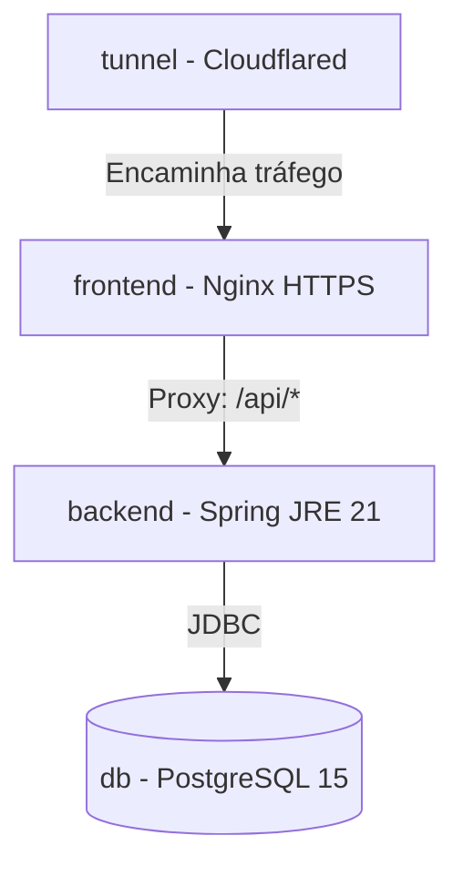

# 🚀 Implantação e DevOps - Face Registry

O projeto **Face Registry** está totalmente conteinerizado usando **Docker** e orquestrado via **Docker Compose**. O ambiente conta com certificação SSL para habilitar o uso da câmera no navegador, banco de dados persistente, caches persistidos para modelos de Inteligência Artificial e suporte a túneis seguros para publicação.

---

## 🏗️ Orquestração de Serviços (Docker Compose)

O arquivo [docker-compose.yml](file:///o:/JavaProjects/face-registry/docker-compose.yml) define quatro serviços que cooperam na mesma rede virtual:



### 1. Banco de Dados (`db`)
- **Imagem:** `postgres:15-alpine` (leve e segura).
- **Persistência:** Volume nomeado `pgdata` mapeado em `/var/lib/postgresql/data`.
- **Healthcheck:** Utiliza a ferramenta nativa `pg_isready` para garantir que o PostgreSQL está aceitando conexões antes de liberar a inicialização do back-end.

### 2. Backend (`backend`)
- **Build:** Compilado a partir de [backend/Dockerfile](file:///o:/JavaProjects/face-registry/backend/Dockerfile).
- **Variáveis de Ambiente Principais:**
  - `SPRING_DATASOURCE_URL`: Aponta para o container `db`.
  - `FACE_RECOGNITION_THRESHOLD`: Define o limiar mínimo de similaridade para aprovação de biometrias (Padrão: `0.60`).
  - `PYTORCH_FLAVOR`: Define a arquitetura do motor PyTorch (CPU por padrão).
- **Persistência do Cache DJL (`djl_cache`):** 
  Os arquivos de pesos dos modelos RetinaFace e FaceNet possuem cerca de 100MB+ e são baixados da internet na inicialização. O volume mapeia `/root/.djl.ai` para evitar que o download ocorra novamente caso o container seja recriado.

### 3. Frontend (`frontend`)
- **Build:** Compilado a partir de [frontend/Dockerfile](file:///o:/JavaProjects/face-registry/frontend/Dockerfile).
- **Geração de SSL/HTTPS:**
  Os navegadores modernos bloqueiam o acesso a APIs de mídia (câmera via webcam) se a página for servida em conexões HTTP inseguras (exceto em `localhost` literal). 
  Durante o build do container do frontend, o `openssl` gera automaticamente um certificado autoassinado de 365 dias para habilitar HTTPS seguro na porta `443` (mapeada para a porta `8000` do host).
- **Proxy Reverso:**
  O arquivo [nginx.conf](file:///o:/JavaProjects/face-registry/frontend/nginx.conf) configura o Nginx para servir os arquivos estáticos do Angular no prefixo `/face-registry/` e encaminhar requisições com prefixo `/api/*` diretamente para o container `backend:8080`.

### 4. Túnel Cloudflare (`tunnel`)
- **Imagem:** `cloudflare/cloudflared:latest`
- **Utilidade:** Permite expor a aplicação rodando localmente para a internet pública de forma segura, sem a necessidade de abrir portas no roteador ou configurar IPs públicos. O container conecta ao proxy do Cloudflare Zero Trust usando o token fornecido em `${TUNNEL_TOKEN}` no arquivo `.env`.

---

## 🐳 Dockerfiles de Build em Estágios Múltiplos (Multi-Stage)

Ambos os Dockerfiles utilizam builds em múltiplos estágios para garantir imagens de produção limpas e sem compiladores extras instalados.

### Dockerfile do Back-end
1. **Estágio 1 (Builder):** Usa imagem Maven com JDK 21 para instalar as dependências e empacotar a aplicação em um arquivo `.jar`.
2. **Estágio 2 (Runtime):** Usa imagem pura JRE 21 (Eclipse Temurin) para rodar o `.jar` final, mantendo a imagem compacta.

### Dockerfile do Front-end
1. **Estágio 1 (Builder):** Usa Node.js 20 para baixar dependências via `npm ci` e buildar a aplicação Angular otimizada para produção.
2. **Estágio 2 (Runtime):** Instala o servidor leve Nginx, gera a chave SSL autoassinada e copia os arquivos compilados da etapa anterior para a pasta pública do Nginx.

---

## 🛠️ Comandos de Operação e Implantação

### 1. Subir toda a Stack localmente compilando do zero:
```bash
docker compose up --build -d
```

### 2. Verificar os logs em tempo real:
```bash
docker compose logs -f
```

### 3. Derrubar o ambiente mantendo os volumes persistentes:
```bash
docker compose down
```

### 4. Limpar banco de dados e caches de modelos:
```bash
docker compose down -v
```
*(Atenção: esse comando apagará todas as biometrias cadastradas e exigirá que o download dos modelos da internet ocorra novamente no próximo boot).*
