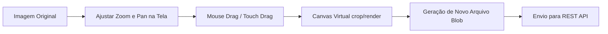

# 🎨 Interface e Front-end - Face Registry

A interface de usuário do **Face Registry** é construída com **Angular 17+** utilizando a arquitetura moderna de **Standalone Components** (sem a necessidade de `NgModule` global). O layout possui estilo dark premium com elementos glassmorphic, desenhado em **CSS Vanilla**.

---

## 🏗️ Estrutura de Arquivos e Componente Standalone

Toda a lógica e apresentação visual está organizada na pasta [frontend/src/app](file:///o:/JavaProjects/face-registry/frontend/src/app):

- **[app.component.ts](file:///o:/JavaProjects/face-registry/frontend/src/app/app.component.ts):** Engine de controle da aplicação. Gerencia os estados reativos da tela, chamadas de rede com `HttpClient`, estados de webcam, zoom/pan e processamento de canvas.
- **`app.component.html`:** O template de marcação HTML5 estruturado semanticamente. Contém a barra de navegação responsiva, o formulário de CRUD individual, os painéis de envio em lote, telas de verificação (1:1) e identificação (1:n).
- **`app.component.css`:** Folha de estilos vanilla. Define as variáveis de cores globais HSL, gradientes lineares de fundo, sombras glassmorphism (com `backdrop-filter: blur`), estilos de loaders e feedbacks, e as regras responsivas.

---

## 📷 Integração com Webcam Nativa

O front-end permite capturar a foto do rosto em tempo real sem a necessidade de plugins ou flash, utilizando a API nativa do navegador:

```typescript
navigator.mediaDevices.getUserMedia({ video: { width: 640, height: 480 } })
  .then((stream) => {
    this.webcamStream = stream;
    const video = document.querySelector('video#webcamVideo') as HTMLVideoElement;
    if (video) {
      video.srcObject = stream;
      video.play();
    }
  });
```

### Captura e Conversão para Envio
Quando o usuário aciona o botão de captura:
1. O frame do vídeo é desenhado em um elemento `<canvas>` virtual nas dimensões atuais de proporção.
2. É gerado um Data URL no formato Base64 (`image/jpeg`).
3. O front-end converte o Base64 em um binário nativo do tipo `Blob` e o encapsula em um objeto `File` padrão:
   ```typescript
   const file = new File([blob], 'foto_captura.jpg', { type: 'image/jpeg' });
   ```
4. Esse arquivo é atribuído ao campo de foto do formulário ativo e enviado no corpo da requisição via multipart form data.

---

## 🔍 Mecanismo de Zoom, Movimentação (Pan) e Recorte

Imagens cruas de câmeras podem conter rostos distantes, mal centralizados ou múltiplos fundos que fariam o motor RetinaFace do backend falhar. O front-end implementa uma ferramenta interativa de reenquadramento baseada em Canvas:



### Como funciona no Código
1. Ao fazer upload de uma foto, o front-end mapeia os eventos de clique e arraste de mouse (`mousedown`, `mousemove`, `mouseup`) ou toques na tela (`touchstart`, `touchmove`, `touchend`).
2. O CSS aplica transformações de escala e translação visual para que o usuário veja a aproximação e posicionamento em tempo real dentro do container:
   `transform: scale(zoom) translate(panX, panY)`
3. **Processamento Final ([getProcessedFile](file:///o:/JavaProjects/face-registry/frontend/src/app/app.component.ts#L644-L713)):** Antes de fazer o envio para a API, o método intercepta o arquivo original e recria a cena em um Canvas oculto:
   - Calcula a proporção física entre a exibição da tela e a resolução nativa da imagem.
   - Aplica os offsets de translação (`panX` e `panY`) e escala de zoom para recortar exatamente a porção selecionada da foto.
   - Converte o resultado de volta em um arquivo de imagem menor e focado apenas no rosto (garantindo que o rosto ocupe a maior parte da foto e facilitando a extração biométrica).

---

## 🛠️ Validações no Lado do Cliente

Para economizar processamento e banda de rede, o front-end executa validações preliminares antes de submeter os dados ao servidor:

1. **Validação de Formatos:** Rejeita de imediato extensões que não sejam `.jpg`, `.jpeg` ou `.png`.
2. **Validação Matemática do CPF:** Implementado via método [isValidCpf](file:///o:/JavaProjects/face-registry/frontend/src/app/app.component.ts#L543-L564). Verifica se o CPF possui 11 dígitos, se não são sequências repetidas (ex: 111.111.111-11) e se os dois dígitos verificadores batem com a fórmula matemática oficial da Receita Federal. O botão de submissão do formulário fica indisponível caso os dados sejam inválidos.
